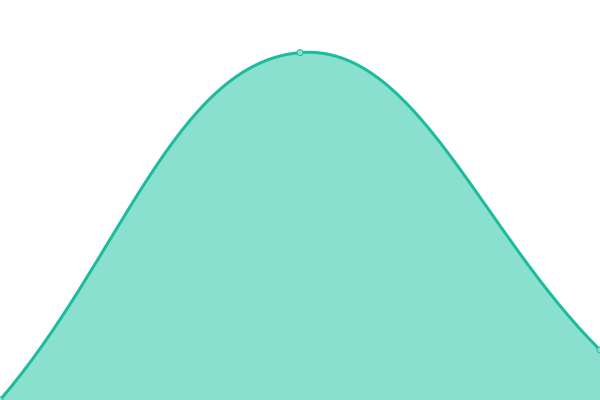
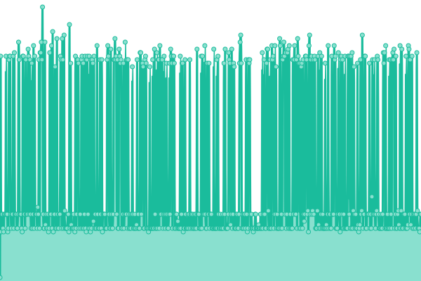

# [📈 Live Status](https://hyenamc.github.io/hyena-upptime): <!--live status--> **🟧 Partial outage**

This repository contains the open-source uptime monitor and status page for [HyenaMC](https://hyenamc.github.io/hyena-upptime), powered by [Upptime](https://github.com/upptime/upptime).

With [Upptime](https://upptime.js.org), you can get your own unlimited and free uptime monitor and status page, powered entirely by a GitHub repository. We use [Issues](https://github.com/hyenamc/hyena-upptime/issues) as incident reports, [Actions](https://github.com/hyenamc/hyena-upptime/actions) as uptime monitors, and [Pages](https://hyenamc.github.io/hyena-upptime) for the status page.

<!--start: status pages-->
<!-- This summary is generated by Upptime (https://github.com/upptime/upptime) -->
<!-- Do not edit this manually, your changes will be overwritten -->
<!-- prettier-ignore -->
| URL | Status | History | Response Time | Uptime |
| --- | ------ | ------- | ------------- | ------ |
|  [Skin Station](https://account.teamhyena.org) | 🟥 Down | [skin-station.yml](https://github.com/HyenaMC/hyena-upptime/commits/HEAD/history/skin-station.yml) | 

 9269ms
     
 | 

<a href="https://HyenaMC.github.io/hyena-upptime/history/skin-station">0.00%</a>
    

|  [Reverse Proxy (Toronto)](mc.teamhyena.org) | 🟩 Up | [reverse-proxy-toronto.yml](https://github.com/HyenaMC/hyena-upptime/commits/HEAD/history/reverse-proxy-toronto.yml) | 

 31ms
     
 | 

<a href="https://HyenaMC.github.io/hyena-upptime/history/reverse-proxy-toronto">100.00%</a>
    

|  [Reverse Proxy (Hefei)](120.78.128.225) | 🟥 Down | [reverse-proxy-hefei.yml](https://github.com/HyenaMC/hyena-upptime/commits/HEAD/history/reverse-proxy-hefei.yml) | 

 0ms
     
 | 

<a href="https://HyenaMC.github.io/hyena-upptime/history/reverse-proxy-hefei">0.00%</a>
    

|  [Main Server (Survival)](minecraft.teamhyena.org) | 🟥 Down | [main-server-survival.yml](https://github.com/HyenaMC/hyena-upptime/commits/HEAD/history/main-server-survival.yml) | 

 0ms
     
 | 

<a href="https://HyenaMC.github.io/hyena-upptime/history/main-server-survival">0.00%</a>
    

<!--end: status pages-->

[**Visit our status website →**](https://hyenamc.github.io/hyena-upptime)

## 📄 License

- Powered by: [Upptime](https://github.com/upptime/upptime)
- Code: [MIT](./LICENSE) © [Anand Chowdhary](https://anandchowdhary.com), supported by [Pabio](https://pabio.com)
- Data in the `./history` directory: [Open Database License](https://opendatacommons.org/licenses/odbl/1-0/)
